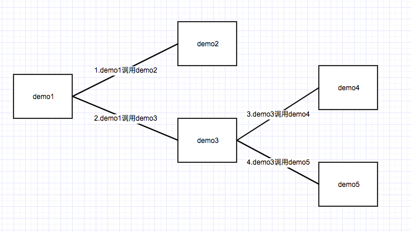
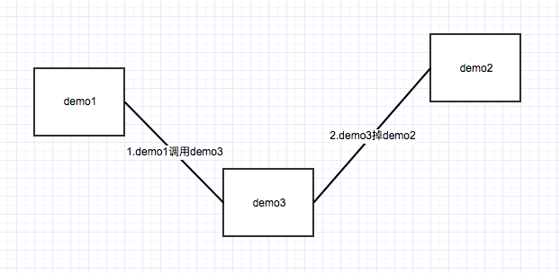
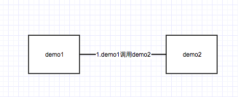
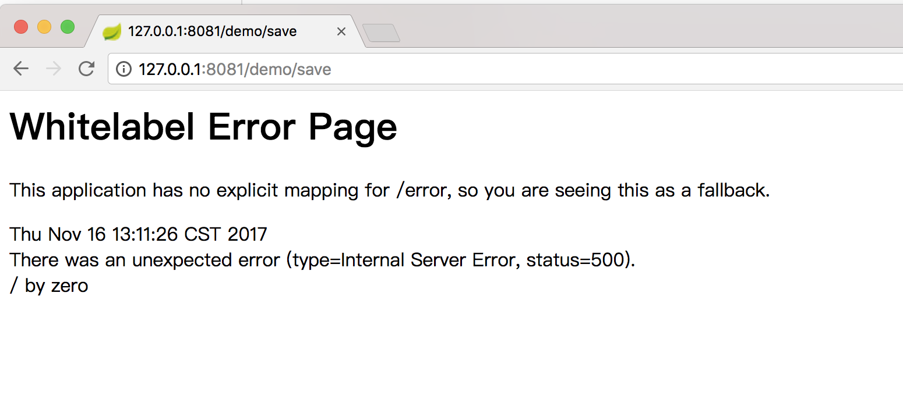

# springcloud LCN分布式事务v4.0 示例demo


## 项目介绍

demo下分为jdbc/jpa/mybatis 三种版本的demo，可根据自己的项目需求来对应查看相关的demo


其中jdbc版本的demo涉及到了5个业务模块，他们的调用关系图如下:





jpa版本的demo中有是哪个模块，其中demo3是没有数据库事务的中间模块：





mybatis版本的demo中使用了hytrix，有两个模块，并且demo1，自定义了TxManager的通讯方式和tx.properties地址的获取方式。调用关系图如下：




## 依赖的服务

springcloud-lcn-demo 需要依赖的服务有：

1. TxManager 
2. Mysql 
3. Redis
4. Eureka 

TxManager的启动与配置见：   

[TxManager启动说明](https://github.com/codingapi/tx-lcn/wiki/TxManager%E5%90%AF%E5%8A%A8%E8%AF%B4%E6%98%8E)

* TxManager启动说明中包含Eureka的配置环境


## 数据库配置与设置

demo项目的数据库配置在application.properties配置文件下

```
spring.datasource.driver-class-name = com.mysql.jdbc.Driver
spring.datasource.url= jdbc:mysql://localhost:3306/test
spring.datasource.username= root
spring.datasource.password=root
spring.datasource.initialize =  true
init-db= true

spring.application.name = demo2
server.port = 8082
#${random.int[9000,9999]}
eureka.client.service-url.defaultZone=http://127.0.0.1:8761/eureka/

#Ribbon的负载均衡策略
ribbon.NFLoadBalancerRuleClassName=com.netflix.loadbalancer.RandomRule
ribbon.MaxAutoRetriesNextServer=0

```

数据库为test，账号密码为root/root，使用者可根据自己的环境调整。

数据库的初始化脚本  

```

USE test;

DROP TABLE IF EXISTS `t_test`;

CREATE TABLE `t_test` (
  `id` int(11) unsigned NOT NULL AUTO_INCREMENT,
  `name` varchar(50) DEFAULT NULL,
  PRIMARY KEY (`id`)
) ENGINE=InnoDB DEFAULT CHARSET=latin1;

```

关于`ribbon.MaxAutoRetriesNextServer=0`，由于springcloud默认是开启的重试机制，开启次机制以后会导致当springcloud请求超时时会重复调用业务模块，从而会引发数据混乱，因此建议将其禁用。对于网络模块超时等故障问题建议使用hytrix方式。

## springcloud-lcn 配置教程

1.  添加maven依赖。请及时关注maven中心库的最新版本，尽量使用最新版本。

```
		<dependency>
			<groupId>com.codingapi</groupId>
			<artifactId>transaction-springcloud</artifactId>
			<version>1.0.0</version>
			<exclusions>
				<exclusion>
					<groupId>org.slf4j</groupId>
					<artifactId>*</artifactId>
				</exclusion>
			</exclusions>
		</dependency>

		<dependency>
			<groupId>com.codingapi</groupId>
			<artifactId>tx-plugins-db</artifactId>
			<version>1.0.0</version>
			<exclusions>
				<exclusion>
					<groupId>org.slf4j</groupId>
					<artifactId>*</artifactId>
				</exclusion>
			</exclusions>
		</dependency>
		
```

2. 设置代理连接池

```
	@Bean
	public LCNTransactionDataSource dataSource() {
		DruidDataSource dataSource = new DruidDataSource();
		dataSource.setUrl(env.getProperty("spring.datasource.url"));
		dataSource.setUsername(env.getProperty("spring.datasource.username"));//用户名
		dataSource.setPassword(env.getProperty("spring.datasource.password"));//密码
		dataSource.setInitialSize(2);
		dataSource.setMaxActive(20);
		dataSource.setMinIdle(0);
		dataSource.setMaxWait(60000);
		dataSource.setValidationQuery("SELECT 1");
		dataSource.setTestOnBorrow(false);
		dataSource.setTestWhileIdle(true);
		dataSource.setPoolPreparedStatements(false);

		LCNTransactionDataSource dataSourceProxy = new LCNTransactionDataSource();
		dataSourceProxy.setDataSource(dataSource);
		dataSourceProxy.setMaxCount(10);
		return dataSourceProxy;
	}

```

3. 添加tx.properties配置


```

#txmanager地址
url=http://127.0.0.1:8899/tx/manager/


```


4. 添加切面事务拦截与order级别

```
import com.codingapi.tx.springcloud.interceptor.TxManagerInterceptor;
import org.aspectj.lang.ProceedingJoinPoint;
import org.aspectj.lang.annotation.Around;
import org.aspectj.lang.annotation.Aspect;
import org.springframework.beans.factory.annotation.Autowired;
import org.springframework.core.Ordered;
import org.springframework.stereotype.Component;


@Aspect
@Component
public class TxTransactionInterceptor  implements Ordered {


    @Override
    public int getOrder() {
        return 1;
    }

    @Autowired
    private TxManagerInterceptor txManagerInterceptor;

    @Around("execution(* com.example.demo.service.impl.*Impl.*(..))")
    public Object around(ProceedingJoinPoint point)throws Throwable{
        return txManagerInterceptor.around(point);
    }
}


```

5. 配置RequestInterceptor拦截

若采用的feign机制，采用如下方式

定义MyConfiguration
```
package com.example.demo.config;

import com.codingapi.tx.springcloud.feign.TransactionRestTemplateInterceptor;
import feign.RequestInterceptor;
import org.springframework.context.annotation.Bean;

public class MyConfiguration {


    @Bean
    public RequestInterceptor requestInterceptor(){
        return new TransactionRestTemplateInterceptor();
    }
}


```

设置feign的configuration


```
@FeignClient(value = "demo2",configuration = MyConfiguration.class,fallback = Demo2ClientHystric.class)

```

若采用RestTemplate的方式，在builder时添加拦截器


```
	@Autowired
	private RestTemplateBuilder builder;

	@Bean
	public RestTemplate restTemplate() {
		return builder.interceptors(new TransactionHttpRequestInterceptor()).build();
	}

```


若采用http请求的方式，可在http请求的header上添加如下配置


```
    TxTransactionLocal txTransactionLocal = TxTransactionLocal.current();
    String groupId = txTransactionLocal == null ? null : txTransactionLocal.getGroupId();
    int maxTimeOut = txTransactionLocal == null ? 0 : txTransactionLocal.getMaxTimeOut();
    if (txTransactionLocal != null) {
        request.addHeader("tx-group", groupId);
        request.addHeader("tx-maxTimeOut", String.valueOf(maxTimeOut));
    }
        

```


## 启动说明

所有的demo启动以后的访问地址都是

[http://127.0.0.1:8081/demo/save](http://127.0.0.1:8081/demo/save)  

请求以后会出现 / by zero异常。这是由于在demo1的最后一句代码上写有`int v = 100/0;`



当把这句代码注释掉以后再执行时，此时观察数据你会发现没有任何数据在数据库下将会看到有两条数据。


